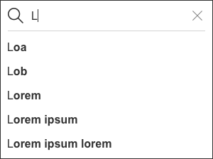

# Search text field / Champ de recherche

Lorsqu'un service présente une grande quantité de données, le champ de recherche permet à l'utilisateur de saisir des caractères  afin de trouver rapidement un contenu.

## Spécifications

- Le champ de recherche est un champ de texte. Ses spécifications sont dans le doc design de celui-ci. Cependant, il y a quelques précisions :
  - Le **label** est absent.
  - Le **texte du placeholder** est obligatoire et précis, ex : Rechercher une commune.
  - L'**icône** Loupe, de type **Information** est toujours présente dans le champ de recherche, cf doc Icons.    Picto ou font ????
  - L'**icône** Vider le champ, de type **Action** est facultative, cf doc Icons.
- À ce jour, SipaUI propose un seul type de champ de recherche : avec auto-complétion.

## Auto-complétion
- L'auto-complétion une fonctionnalité permettant à l'utilisateur de limiter la quantité d'informations qu'il saisit avec son clavier. Il est guidé dans la construction d'une requête en se voyant proposer un complément qui contient la chaîne de caractères qu'il a commencé à taper.
- Avec ce champ de recherche, **l'utilisateur ne peut que choisir une suggestion** parmi cette liste. S'il appuie sur la touche de validation native pour soumettre sa recherche saisie, aucune action se produira.
- Chaque suggestion est normée :
  - La 1re lettre du texte est en majuscule, le reste est en minuscule.
  - Le contenu se limite à une seule ligne.
  - L’ordre est établi de manière logique : selon la pertinence, l'ordre alphabétique, etc.

Etat | Enabled | Focus | Saisie | Select
------------ | ------------- |------------ | ------------ |------------ |
Illustration |  |  |  |  
Container | Absent | Absent | Hauteur : 34px par suggestion   Largeur : celle de la zone de recherche   Fond : #FFFFFF   Contour : épaisseur 1px, #333333   Ligne de séparation : épaisseur 1px, #D4D4D4   Texte saisi : standard   Texte suggéré : standard bold    Padding à droite et à gauche du texte : 10px| -   -   -   -   -   -   Texte sélectionné : #B40015 | Opacité : 40 % | Hauteur : 44px   Largeur : celle de son container parent moins le padding de celui-ci, 140px minimum   Fond : #FAFAFA   Contour : épaisseur 1px, #D4D4D4

## Bonnes pratiques
- Mettre le champ de recherche là où les utilisateurs s’attendent de le retrouver.
- La largeur du champ doit être suffisante : le champ contient au moins 27 caractères visibles.
### Auto-complétion
- Dans le cas d'une auto-complétion, les suggestions doivent être utiles, pertinentes. Celles mals conçues peuvent troubler et distraire les utilisateurs.
- Un nombre limité de suggestions permet que l’information ne soit pas écrasante. Plus de 10 items semblent excessifs.
- Le champ de recherche peut afficher des suggestions dès qu'il est sélectionné, par exemple les plus consultées.
- Sur desktop, la navigation au clavier permet de choisir facilement une suggestion. Une fois que l'utilisateur a scrollé vers le bas jusqu’au dernier item, il doit revenir en haut de la liste. La touche “esc” doit permettre aux utilisateurs de sortir de la liste.
- Afin de faciliter la lecture, seules les premières lettres des suggestions sont les caractères saisis. Quand l'utilisateur tape "Sév", "Cesson-Sévigné" ne s'affiche pas.
- Des outils permettent d'améliorent l'expérience utilisateur : autocorrection d’orthographe, les textes prédictifs, ect.
