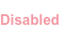
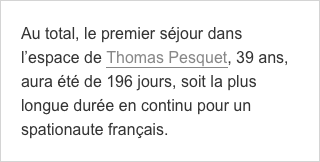

# Links / Liens

Les liens permettent à l'utilisateur d'atteindre un autre endroit de la page, une autre page, un autre site ou un document non web.

## Usage

**Les liens rendent les actions visibles** et permettent aux utilisateurs d'effectuer une action. Par exemple dans un article, un lien permet d'ouvrir un autre article.

## Types de liens
### Lien article
Un lien article se trouve **parmi un bloc de texte** (article…). Il apporte une information supplémentaire.

Enabled | Hover / Focus / Pressed
------------ | ------------- |
| 
Hauteur du texte    Largeur du texte   Couleur : #878787   Taille de caractère de son contexte    Graisse de son contexte   Police du thème | -   -   Couleur : #B40015   -   -   -   Texte : le lien est souligné en #B40015  

### Lien bouton
Un lien bouton **se positionne comme un bouton** mais a l’apparence d’un lien. Son action est mineure par rapport aux boutons primaires et secondaires. Un tel lien ne peut donc pas être inclus dans du texte.

Enabled | Hover / Focus / Pressed | Disabled
------------ | ------------- | ------------- |
 |  | 
Hauteur : 44px    Largeur du texte   Couleur : #E2001A   Taille de caractère : 16px   Graisse : bold   Police du thème | -   -   Couleur : #B40015    -   -   -   Texte : le lien est souligné en #B40015 | Opacité : 40 %

Contrairement aux boutons primaires et secondaires, le lien bouton ne présente pas de padding et sa largeur minimale n'est pas définie.

## Bonnes pratiques
### Comportement

  |
------------ |
**Do**   Si l'action modifie des données, utiliser un bouton. |

 

 

  |
------------ |
**Don’t**   Si l'action modifie des données, ne pas utiliser un lien. |

 

 

- Lorsque vous utilisez un bouton primaire et un bouton secondaire, le bouton primaire doit être placé à gauche. **Une exception s'applique dans le cas d'écran séquentiel**, le bouton primaire est à droite.

### Contenu

- Mettre le minimum de texte tout en expliquant clairement ce qui se passe lorsque ce lien est activé.
- Évitez les termes génériques tels que «Cliquez ici», «Ici», «En savoir plus» ou l'adresse Web qui ne fournissent pas d'information aux utilisateurs sur le contenu du lien.
- Sur une même page, mettre des noms distincts pour des liens différents.

#### Lien éditorial

Enabled | Hover / Focus / Pressed
------------ | -------------
 |

- Commencer par les mots-clés.
- Il est conseillé que le lien n’ait pas plus de 10 mots pour une meilleure performance.
- Le texte du lien doit être similaire au titre de la page qu'il ouvre.
- Ne pas mettre le même nom pour différents liens.

#### Lien bouton
- La 1re lettre du lien est en majuscule, le reste est en minuscule.
- Le texte du lien doit être uniquement sur une seule ligne.

## Autres composants
- Titre avec chevron
- Lien blank
- Lien download
- Partage social
- Fil d’ariane
- Etc.
