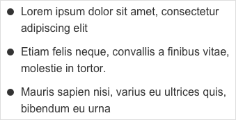
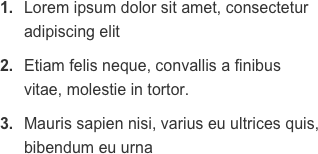
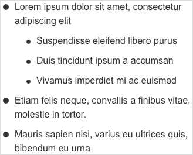
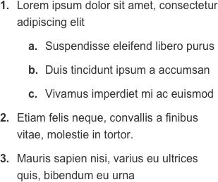

# Lists / Listes

Les listes sont composées de contenus associés, regroupés et organisés. Elles peuvent contenir du texte, des liens, etc.

## Usage

Les listes sont utilisées pour afficher un nombre d'éléments reliés de façon consécutive. Habituellement, les éléments d'une liste s'affichent l'un en dessous de l'autre.

## Types

### Liste non ordonnée

- Dans une liste non ordonnée, **l'ordre des éléments n'importe pas**.
- Une puce de taille constante est présente devant chaque ligne.
- Par exemple, l'ordre d'une liste de courses n'a pas grande importance.

  Les puces sont des repères visuels.

### Liste ordonnée

- Les éléments d'une liste ordonnée sont disposés dans **un ordre précis**.
- Un numéro et un point sont placés devant chaque ligne.
- Afin de faciliter la lecture, les points sont alignés verticalement et les chiffres sont ferrés à droite.
- Concrètement, ces listes sont utilisées pour décrire des processus pas-à-pas tels qu'une recette de cuisine.

  Les numéros rythment et organisent les éléments.

### Les listes imbriquées

- L'imbrication des listes permet une présentation claire et détaillée grâce à **un deuxième niveau** aux listes non ordonnées et ordonnées.
- Les listes imbriquées sont utilisées pour des listes de liens hiérarchisés tels qu'un plan de site ou menu déroulant.
- Dans une liste ordonnée et imbriquée, le nombre d'éléments est limité à 26 : de " a " à " z ".

  Un **cercle** matérialise les listes non ordonnées imbriquées.

  Des **lettres en minuscule** permettent de classer les listes ordonnées imbriquées.

## Bonnes pratiques
- Les listes présentent des informations simples et courtes.
- Les listes doivent être triées de manière logique pour faciliter l'analyse du contenu, par exemple alphabétique, numérique, chronologique ou par préférence pour l'utilisateur.
