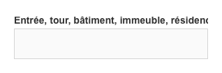

# Labels / Labels

Les labels permettent à l’utilisateur de savoir à quel type d’information attendue correspond le composant qui lui est associé (champ texte, liste déroulante…). Ils se trouvent généralement dans un formulaire.

## États

Type | Simple
------------ | ------------- |
**Standard** | 
**Facultatif** | 
**Inactif** | 

## Spécifications

#### Label
- Un label indique le type d’information demandée sous celui-ci.
- La 1re lettre est en majuscule, le reste est en minuscule.

  

  

 |
  ------------ |
  **Do**   Utiliser un texte court et précis. |

   

   

 |
  ------------ |
  **Don’t**   Ne pas rédiger un label sur plus d'une ligne. |

   

   

- Taille de caractère : 14px
- Line-height : 1,2
- Graisse de caractère
  - Texte standard : bold
  - Texte d'aide ou «&nbsp;facultatif&nbsp;» : régular
- Police du thème
- Couleur : #333333
- Margin bottom : 3px
- Label pour champs obligatoires/facultatifs
  - Par défaut, tous les champs sont obligatoires.
  - Le texte, par exemple «&nbsp;facultatif&nbsp;»
    - Est précisé entre parenthèse suite au label
    - Regular
    - Color : #666666
    - Taille de caractère : 12px
 - Label pour champs readonly/inactifs&nbsp;: opacité = 40 %
