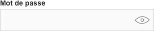
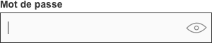

# Password fields / champs mot de passe

Les champs mot de passe sont des champs de texte où les caractères saisis sont masqués.

## Usage

- Les caractères sont saisis en toute discrétion et sécurité.
- Un champ mot de passe se trouve généralement lors d’une connexion ou d’une création de compte.

## Spécifications

Type | Illustration
------------ | ------------- |------------ | ------------- |
**Enabled** | 
**Focus** | 
**1er caractère saisi** | image
**Champ visible** | image
**Error** | image
**Disabled** | image

Le champ mot de passe présente toutes les caractéristiques (intéraction, police, hauteur…) d’un champ de texte. La seule différence est la visibilité des caractères saisis.

## Visibilité

- La visibilité du mot de passe permet de réduire les erreurs.
- La saisie du mot de passe est masquée par défaut. Des ellipses ou des astérisques, selon le système d'exploitation sont affichées pour représenter chaque caractère du mot de passe saisi : •••••••.
- Suite à la validation du formulaire, l'état de visibilité reste identique.
### Icônes “voir”
- Cet icône permet d'afficher les caractères saisis. Elle apparait dès la saisi du 1er caractère.
- L'icône “œil” barré” permet de masquer les caractères saisis. **?**
- Les icônes “voir” et “oeil barré” ont les caractéristiques d’une icône d’un composant text field.
- Lorsque l’input est en focus **?**, l’icône “voir” est collé à gauche de l’icône “ croix “. 
!!! image d’illustration !!! X puis oeil

### Barre de sécurité

- Elle informe l'utilisateur du niveau de sécurité du mot de passe en cours de création. Cette barre encourage l’utilisateur à créer un mot de passe plus sécurisé sans le contraindre.
- Elle s’affiche dès la saisi du 1er caractère. Puis, elle est toujours présente, même après validation du formulaire.
- Elle se situe sous le champ mot de passe.
- La sécurité évolue au et à mesure que l’utilisateur saisi les caractères. 5 niveaux sont représentés :

Niveau | Illustration | Couleur
------------ | ------------- |------------ | ------------- |
**1** |  à modifier | #D4D4D4
**2** |  | #B40015
**3** | image | #FFCC33
**4** | image | #87A62C

### Règles de conformité
- Lors de la création d'un mot de passe, elles informent l'utlisateur des consignes obligatoires.
- Elles sont toujours visibles, même après validation du formulaire.
- Elle s'affiche sous la barre de sécurité.
- Chaque règle se valide lors de la saisi des caractères dans le champ mot de passe.

Nature | Illustration | Couleur
------------ | ------------- |------------ |
**Information** | image | #333333
**Ok** | image | #87A62C
**Ko** | image | #B40015

- Une règle est définie comme ko suite à la validation du formaire.

### Gestion des erreurs
- Le contrôle s’effectue suite à la validation du formulaire.

!!!image!! lors de l'inscription 2 images Avant et Après validation Lors de la création du mot de passe les règlès non respectées s'affiche en rouge.

## Bonnes pratiques

- Les messages d’erreur guident l'utilisateur afin de résoudre le problème. Par exemple le nombre de caractère doit inférieur 6 : “ Votre mot de passe doit contenir au moins 6 caractères. ”
- Autoriser les copier / coller lors de la connexion et création de mot de passe.
- Les caractères de retour chariot ne sont pas autorisés. Ils ne sont pas pris en compte lors de la saisi.
