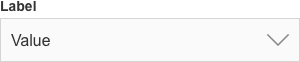
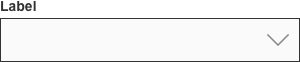
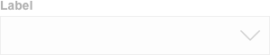
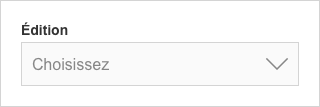
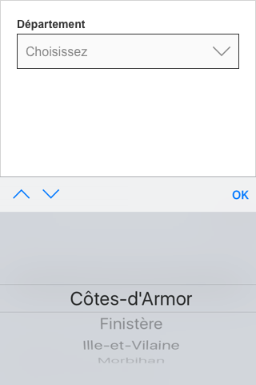
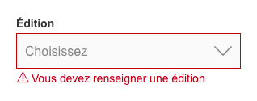

# Selects / Menu déroulant

Les selects permettent à l’utilisateur de sélectionner une option dans une liste.

## Usage

- Un select permet d’afficher un nombre illimité d'options dans une liste déroulante. L’utilisateur peut choisir une seule des options parmi cette liste.
- Il empêche les utilisateurs de saisir des données erronées et il permet d'économiser quelques frappes.
- On le trouve généralement dans un formulaire.

## États

Type | Simple
------------ | ------------- |
**Enabled** | 
**With default value** |
**With placeholder** |
**Focus** |
**Error** |
**Disabled** |

## Spécifications

### Label

- Le label est identique à celui du champ de texte.
- Il est facultatif.
- En son absence, un placeholder est nécessaire.

### Container

- Le container est identique à celui du champ de texte.

### Texte

- Le texte présente les caractéristiques du champ de texte.
- Une value peut être mise par défaut si elle est quasiment sûre d'être choisie.
- Un placeholder peut être affiché, il permet de guider l’action de l’utilisateur.

 |
------------ |
**Do**   Par exemple, "Choisissez" insite l'utilisateur à ouvrir le champ.

 

 

### Placeholder

- Le placeholder comporte les caractéristiques du champ de texte.
- Il n'est pas un attribut html. Cependant, il possible de la simuler.
- Il est facultatif.
- En son absence, un label est nécessaire.

### Icône

- L'icône comporte également les caractéristiques du champ de texte.
- La seule icône possible est un chevron. Il indique qu’une liste est disponible.

### Liste

- La liste permet de présenter différentes options.
- Elle s'affiche de manière native selon chaque navigateur (hauteur, selection, scroll, etc).
- Chaque élément est normé :
  - La 1re lettre du texte est en majuscule, le reste est en minuscule.
  - Le contenu se limite à un seule ligne.
  - Il est justifié à gauche.
  - L'ordre est établi de manière logique : dans un ordre croissant, selon la fréquence d'utilisation, etc.

  

  

   |
  ------------ |
  **Do**   L'ordre alphabétique est souvent le plus approprié.

   

   

- L'élément sélectionné remplace la value par défaut.

### Inactif
L'opacité d'un champ inactif est 40 %.

## Gestion des erreurs

- Les erreurs sont traitées comme celles du champ de texte.
- Si le champ est obligatoire, il est défini comme ko lorsqu’aucun choix n’a été fait.

  

  

   |
  ------------ |
  **Do**   Dans le cas d'un select obligatoire, le message d'erreur demande de renseigner le champ.

   

   

## 4- Bonnes pratiques

- Si le nombre d’options est inférieur ou égale à 3, utiliser un bouton radio.
- Eviter les très longues listes nécessitant un scroll car les utilisateurs ne peuvent voir tous les choix en un coup d'œil.
- Pour une quantité, le choix d’une année, utiliser un text field standard plutôt qu’un select car la saisie est plus rapide.
- Lors de la saisie d'une ville, ne pas utiliser un select. En France, la liste des communes évolue régulièrement et cette liste est difficilement mis à jour.
- Il est fortement recommandé de ne pas styler les selects pour des raisons d'accessibilité.
- Le select est pris en charge par un clavier.

## 5- Autres composants

- Select avec une sélection multiple
- Select avec un champ de recherche
- Datepicker
