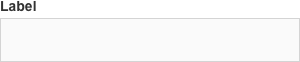
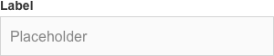

# Text field / Champs de texte

Les champs de texte permettent à l'utilisateur de saisir et de modifier du texte. Ils se trouvent généralement dans un formulaire. Ce composant regroupe les champs texte standards (input text, input number… et le text area).

## États

Type | Illustration
------------ | ------------- |
**Enabled** | 
**With placeholder** | 
**With default value** |    
**Focus** |
**Error** | 
**Disabled** | 
**With icon** | 

## Spécifications

#### Label
- Le composant "Label" indique le type d’information demandée sous celui-ci.
- Ses spécifications sont disponibles dans son doc design.

#### Container
- Un container indique à l'utilisateur où saisir l'information.
- Il est aligné à gauche avec le label.
- Hauteur : 44px
- Largeur : celle son parent moins le padding de celui-ci
- Largueur minimale : 140px
- Couleur de fond
  - Par défaut : #FAFAFA
  - En focus et actif : #FFFFFF
- Contour
  - Couleur par défaut : #D4D4D4
  - Couleur en focus et actif : #333333
  - Épaisseur : 1px

#### Texte
  - Le texte présente les caractères saisis par l'utilisateur.
  - Padding gauche et à droite : 15px du container
  - Taille de caractère : 16px
  - Graisse de caractère : regular
  - Police du thème
  - Couleur : #333333

#### Texte du placeholder
- Le texte du placeholder est une description supplémentaire au label. En aucun cas, il ne le substitue. Il doit guider l’utilisateur sur le format de données attendu. On peut ainsi présenter un exemple (&nbsp;prenom.nom@domaine.fr&nbsp;) ou un pattern (date&nbsp;: &nbsp;jj/mm/aaaa&nbsp;).
- Il est facultatif.
- Il se trouve dans le container et n'est plus visible lors de la saisie.
- Padding gauche et à droite : 10px du container (11px avec le filet)
- Taille de caractère : 16px
- Graisse de caractère : regular
- Police du thème

#### Champ non modifiable (readonly)
  - Opacité : 40 %

### Icône
- Une icône est un bouton intégré dans le container qui permet une action spécifique.
- Elle est située à droite dans le container.
- Taille maximale : 34x34px
- Zone de tap : 44x44px
- L’icône est centrée dans la zone de tap avec une marge minimale : 5px
- Couleur
  - Par défaut : #878787
  - En hover, focus et pressed : #333333
- Cas particulier : la croix
 - Une croix permet la suppression totale et directe d'un champ.
 - Elle est présente lorsque l’input est en focus et qu'un contenu est présent.

## Gestion des erreurs
- Un champ obligatoire est défini comme ko lorsque le texte n'est pas correct ou est absent.

#### Message d'erreur
- Lorsque le champ est ko, un message d'erreur guide l’utilisateur sur la manière de résoudre le problème.
- Il apparait sur une seule ligne.
- Tant que l'erreur n'est pas corrigée, il reste affiché. Dans un formulaire, l'état d’erreur disparait suite à la validation de l’ensemble de la page.
- Le message s'affiche sous la ligne de saisie.
- Taille de caractère : 14px
- Graisse de caractère : regular
- Police du thème
- Couleur : #B40015
- Une icône d'erreur précède le message d'erreur
  - Couleur : #B40015
  - Title : error

#### Contour du container
  - Épaisseur : 1px
  - Couleur : #B40015

## Autres composants
- Champs de recherche
- “ Votre adresse email OK ”
- Mot de passe
- Tooltip
- Sélecteur de date
- Etc.
