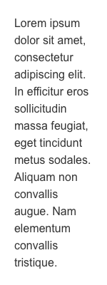
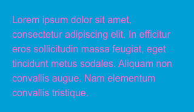

# Standards text / Textes standards

Les textes standards sont le principal moyen utilisé pour visualiser le contenu. Ils garantissent que l’interface utilisateur soit optimisée pour être lisible et performante.

## Usage

 Le texte standard est généralement utilisé pour de long texte.

## Spécifications

- Police&nbsp;: Arial
- Graisse&nbsp;: Normal
- Taille&nbsp;: 16px
- Couleur&nbsp;: #333333
- Marge supérieure d’un paragraphe sous un autre paragraphe ou d’une liste&nbsp;: 20px

## Bonnes pratiques

### Mise en page

- La typographie alignée à gauche fournit à l’œil un point de départ constant pour chaque ligne et facilite la lecture du texte.
- Les colonnes contribuent, en premier lieu à la lisibilité et au confort de lecture.
  - La longueur optimale d’une ligne est comprise entre 45 et 90 caractères. Le retour à la ligne rythme la lecture. Il opère des relances naturelles qui permettent de garder la concentration du lecteur.
  - Un pavé de texte composé en justification courte semble plus «&nbsp;digeste&nbsp;» que le même texte composé en justification longue.

|
  ------------ |
**Don’t**  

|
------------ |
**Do**  

|
------------ |
**Don’t**  

### Accessibilité

- Les petites tailles de police sont moins accessibles et fatiguent les yeux.
- Les interlignes assez grands facilitent la lecture.
- Le contraste est un facteur essentiel pour un texte facile à lire. Le noir sur blanc est évidemment le contraste standard.

 

 

|
------------ |
**Don’t**   La couleur du texte doit être compatible avec l’arrière plan.

 

 

