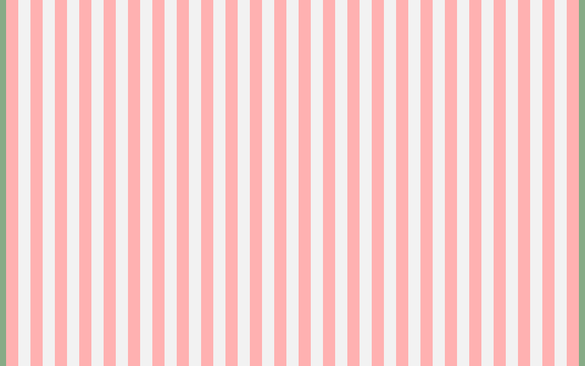

# Grids / Grilles

Une grille est une armature qui permet d'organiser une page et son contenu. Les éléments sont ainsi cadrés et les espaces négatifs sont harmonisés. L'expérience utilisateur est alors cohérente quelque soit la taille et l'orientation de l'écran.

## Usage

La grille est une aide autant pour le concepteur que pour l'utilisateur. Cela permet d'atteindre un équilibre harmonieux pour l'espacement vertical entre les différents blocs. On obtient alors des pages plus lisibles et variés tout en assurant une cohérence générale.

## Anatomie

Une grille est constituée de colonnes, séparées par des gouttières permettant de structurer le contenu. Il ne faut pas oublier les marges qui encadrent le tout.

### Colonnes

- Les colonnes permettent de positionner les éléments horizontalement.
- Sur mobile, la grille comporte 6 colonnes.
- A partir 768px, la grille contient 24 colonnes.
- Elles peuvent être imbriquées.
- La largeur des colonnes varie en fonction de la taille d'écran.

### Gouttières

- Les gouttières sont les espaces entre les colonnes.
- Ces espaces vides segmentent l’information et permettent de faire respirer la page. La circulation des blancs permet de rythmer la page.
- Leur largeur est fixe : **20px**.

### Marges
- La grille dispose de marges latérales entre le contenu et les bords gauche et droit de l'écran. L'objectif est que l'œil puisse bénéficier d'un confort de lecture en ne "tapant" pas contre les bords de la fenêtre du navigateur.
- Le contenu est centré entre les marges.

Taille de l'écran | 320 à 359px | 360 à 767px | 768 à 979px | 980 à 1279px | À partir de 1280px
------------ | ------------- | ------------- | ------------- | -------------
Nombre de colonnes | 6 | 6 | 24 | 24 | 24
Taille de la marge externe | 20px | 30px | 49px et plus | 10px et plus | 10px et plus
Largeur du container  | variable  |  variable | 670px ?  | 960px  | 1260px
Gouttières | 20px | 20px | 20px | 20px | 20px

------------ |
**Do**   Écran mobile de 320px

 ------------ |
**Do**   Écran mobile de 360px

 |
------------ |
**Do**   Écran tablette de 940px

 

 

 

 

 |
 ------------ |
 **Do**   Écran desktop de 1260px

  

  

### Autres composants
- Marges
- Points d'arrêt
- Etc.
