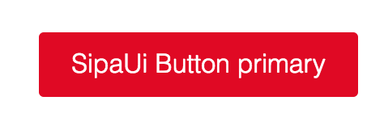

# button

Un bouton permet de ...

## Style

#### button-default

Le `bouton-default` est le bouton d'action principal d'un écran.

#### button-primary

Le `bouton-primary` est le bouton d'action principal d'un écran.

## Behavior
<!-- Comportement -->

#### On hover
<!-- Au survol -->

<!-- Insérer screenshot + texte explicatif -->

#### Contexte XXX

<!-- Insérer screenshot + texte explicatif -->
