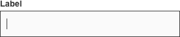
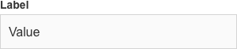
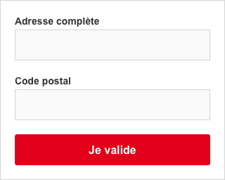
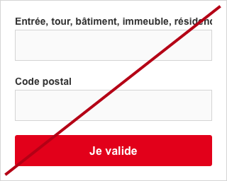
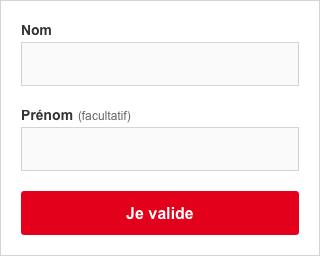

# Text field/champs de texte

Les champs de texte permettent à l'utilisateur de saisir et de modifier du texte. Ils se trouvent généralement dans un formulaire. Ce composant regroupe les champs texte standards (input text, input number… et le text area). Les composants plus avancés, comme le mot de passe sont des composants spécifiques.

## États

Type | Simple
------------ | ------------- |
**Default** | 
**Focus** |
**With default value** |  
**Error** | 
**Disabled** | 
**With icon** | 

## Spécifications
#### Label
- Un label indique le type d’information demandée sous celui-ci.
- La 1re lettre est en majuscule, le reste est en minuscule.

  |
------------ | -------------
   **Do** Utiliser un texte court et précis. |  **Don't** Ne pas rédiger un label sur plus d'une ligne

- Taille de caractère : 14px
- Line-height: 1,2
- Graisse de caractère
  - Texte standard : bold
  - Texte d'aide ou «&nbsp;facultatif&nbsp;» : régular
- Police du thème
- Couleur : #333333
- Margin bottom : 3px
- Champs obligatoires/facultatifs
  - Par défaut, tous les champs sont obligatoires.
  - Le texte, par exemple «&nbsp;facultatif&nbsp;»
    - Est précisé entre parenthèse suite au label
    - Regular
    - Color: #666666
    - Taille de caractère : 13px

#### Container
- Un container indique à l'utilisateur où saisir l'information.
- Il est aligné à gauche avec le label.
- Hauteur : 44px
- Largeur : celle son parent moins le padding de celui-ci
- Largueur minimale : 140px
- Couleur de fond
  - Par défaut : #FAFAFA
  - En focus et actif : #FFFFFF
- Contour
  - Couleur par défaut : #D4D4D4
  - Couleur en focus et actif : #333333
  - Épaisseur : 1px

#### Texte
  - Le texte présente les caractères saisis par l'utilisateur.
  - Padding gauche et à droite : 15px du container
  - Taille de caractère : 16px
  - Graisse de caractère : regular
  - Police du thème
  - Couleur : #333333

#### Texte du placeholder
- Le texte du placeholder est une description supplémentaire au label. En aucun cas, il ne le substitue.
- Il se trouve dans le container et n'est plus visible lors de la saisie.
- Padding gauche et à droite : 10px du container (11px avec le filet)
- Taille de caractère : 16px
- Graisse de caractère : regular
- Police du thème

#### Champ non modifiable (readonly)
  - Opacité : 40 %

### Icône
- Une icône est un bouton intégré dans le container qui permet une action spécifique.
- Elle est située à droite dans le container.
- Taille maximale : 34x34px
- Zone de tap : 44x44px
- L’icône est centrée dans la zone de tap avec une marge minimale : 5px
- Couleur
  - Par défaut : #878787
  - En hover, focus et pressed : #333333
- Cas particulier : la croix
 - Une croix permet la suppression totale et directe d'un champ.
 - Elle est présente lorsque l’input est en focus et qu'un contenu est présent.

## Gestion des erreurs
- Un champ est défini comme ko lorsque le texte n'est pas correct ou est absent.

#### Message d'erreur
- Le message d'error s’affiche lorsque le champ est ko.
- Il guide l’utilisateur sur la manière de résoudre le problème.
- Il apparait sur une seule ligne.
- Celui-ci est présent sous la ligne de saisie.
- Tant que l'erreur n'est pas corrigée, il reste affiché. Dans un formulaire, l'état d’erreur disparait suite à la validation de l’ensemble du formulaire.
- Taille de caractère : 14px
- Line-height : 18px
- Graisse de caractère : regular
- Police du thème
- Couleur : #B40015
- Une icône d'erreur précède le message d'erreur
  - Couleur : #B40015
  - Title : error

#### Contour du container
  - Épaisseur : 1px
  - Couleur : #B40015

## Autres composants
- Champs de recherche
- “ Votre adresse email OK ”
- Mot de passe
- Tooltip
- Sélecteur de date
